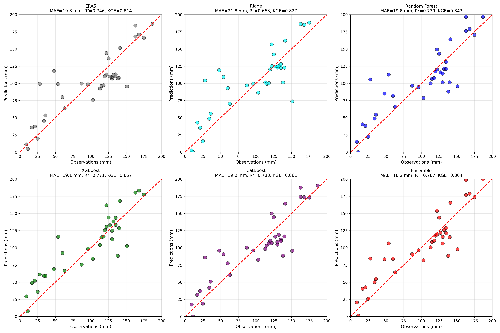
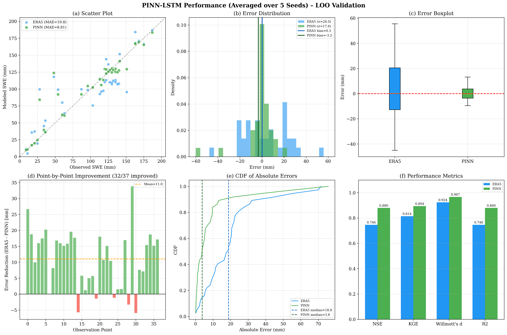
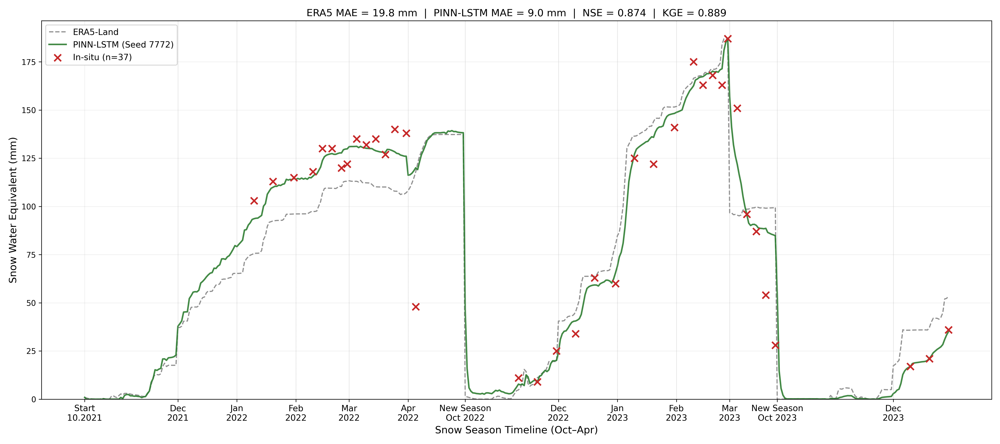

# ❄️ ERA5-Land SWE Bias Correction using ML, LSTM/GRU, and Physics-Informed Neural Networks


**Correcting systematic errors in Snow Water Equivalent (SWE) from ERA5-Land reanalysis using machine learning, deep learning, and physics‑informed neural networks.**

---

## 📌 Table of Contents

1. [What is this project?](#-what-is-this-project)
2. [Data](#-data)
3. [Project Pipeline](#-project-pipeline)
4. [Models](#-models)
5. [Feature Engineering](#-feature-engineering)
6. [Validation Strategy](#-validation-strategy)
7. [Key Results](#-key-results)
8. [Key Visualizations](#-key-visualizations)
9. [Visualizations](#-visualizations)
10. [Repository Structure](#-repository-structure)
11. [How to Run](#-how-to-run)
12. [Tech Stack](#-tech-stack)
13. [Why PINN works well](#-why-pinn-works-well)
14. [Reproducibility](#-reproducibility)
15. [License & Citation](#-license--citation)

---

## 🚀 What is this project?

ERA5-Land provides daily Snow Water Equivalent (SWE) estimates, but they often contain systematic biases relative to ground observations. This project builds a **bias‑correction framework** that learns the residual between ERA5-Land SWE and station measurements, then adds that correction to the original product.

Three model families are compared:

- **Classical Machine Learning**: Ridge, Random Forest, XGBoost, CatBoost, Ensemble  
- **Deep Learning**: LSTM and GRU using temporal sequences of meteorological variables  
- **Physics‑Informed Neural Network (PINN) / physics‑informed hybrid model**: combines simplified snow physics with a learnable correction network  

The final output is a **corrected daily SWE time series** that significantly reduces errors compared to the raw ERA5-Land product.

---

## 🗺️ Data

### Sources

| Data Source | Variables | Period |
|-------------|-----------|--------|
| ERA5-Land | 2 m temperature, precipitation, snow cover, albedo, shortwave/longwave radiation, wind components, soil moisture | 2014–2023 |
| MODIS | Snow cover (MOD10A1), Land Surface Temperature (MOD11A1) | 2014–2023 |
| SRTM | Elevation, slope, aspect | static |
| Shemonaikha station | Observed SWE (37 measurements) | 2022–2023 |

### Preprocessing

- Satellite and reanalysis data were obtained from Google Earth Engine and Copernicus/ERA5-Land sources.
- Units were standardized (e.g., temperature K→°C, precipitation m→mm).
- Multiple sources were merged by date and location.
- SWE was calibrated using seasonal linear regression against station data.
- The final clean dataset is stored at:

```
data_preprocessing/processed/shemonaikha_snow_dataset_2014_2023.csv
```

---

## 🔄 Project Pipeline

```text
ERA5-Land ─┐
MODIS ─────┤
SRTM ──────┤
Station ───┘
     ↓
Preprocessing & Feature Engineering
     ↓
┌────────────┬──────────────┬──────────────┐
│ Classical  │ LSTM / GRU   │     PINN     │
│ ML         │              │              │
└────────────┴──────────────┴──────────────┘
     ↓
Bias Correction
     ↓
LOO + Temporal Evaluation
     ↓
MAE / RMSE / NSE / KGE
```

---

## 🧠 Models

### 1. Machine Learning (ML)

- **Ridge**: linear model with L2 regularization
- **Random Forest**: 100 trees, max depth 3
- **XGBoost**: 100 trees, max depth 3, learning rate 0.05
- **CatBoost**: 100 iterations, depth 3, learning rate 0.05
- **Ensemble**: average of RF, XGB, and CatBoost

**Approach:**  
Each model predicts the **bias** (observed SWE − ERA5 SWE).  
The final prediction is:

```
SWE_corrected = SWE_ERA5 + predicted_bias
```

### 2. Deep Learning (LSTM / GRU)

- Input: sequence of 30 previous days (meteorological and snow features)
- Architecture: 2 recurrent layers, hidden size 32, dropout 0.3
- Output: scalar bias correction
- Training: MSE loss, Adam optimizer, gradient clipping
- **Multi‑seed averaging**: predictions are averaged over 5 fixed seeds to reduce variance

### 3. Physics‑Informed Neural Network (PINN) / Physics‑Informed Hybrid Model

The PINN consists of three components:

1. **Physical core** – simplified snow mass balance:
   ```
   dSWE/dt = snowfall - melt - sublimation
   ```
   with learnable parameters for:
   - snowfall threshold (temperature)
   - melt factors (temperature, solar radiation, thermal radiation)
   - sublimation factor (wind)
2. **Trainable blending** between physics-based SWE and ERA5-Land SWE:
   ```
   SWE_blend = w_phys * SWE_physics + w_era5 * SWE_ERA5
   ```
3. **Neural corrector** – a small MLP that further adjusts the blended result

The total loss is:
```
L = L_data + λ1 * L_era5 + λ2 * L_correction + λ3 * L_smooth
```

This combination of physical constraints and data-driven correction makes PINN especially effective with limited ground observations.

---

## 🔧 Feature Engineering

The following features were created for each model:

| Category | Features |
|----------|----------|
| Calendar | day of year (sin/cos), month (sin/cos) |
| Meteorology | temperature, precipitation, wind speed, snow cover, albedo |
| Radiation | solar net, thermal net |
| Derived | melt potential, soil moisture percentage |
| Lagged | temperature lag 1–3, precipitation lag 1–3 |
| Cumulative | cumulative precipitation, cumulative snowmelt (within water year) |

> **Causality:** All lagged, rolling, and cumulative features were constructed using only information available up to the prediction date – no future data were used.

For sequence models (LSTM/GRU/PINN), 30-day windows of the above features were used.

---

## ✅ Validation Strategy

### Leave‑One‑Out Cross‑Validation (LOO)

Each of the 37 observed SWE measurements is used as a held‑out evaluation point.  
For each fold, the corresponding target observation is excluded from model fitting.

### Multi‑seed Averaging

Neural networks are sensitive to random initialization.  
To obtain robust estimates, predictions are averaged over **5 fixed seeds**:

```
42, 123, 456, 789, 1024
```

### Additional Experiments

- **Seed sensitivity**: tested 20 different seeds to quantify variability.
- **True out‑of‑sample temporal evaluation**: trained using data available before 2022, with ground observations from 2022–2023 excluded from training and used only for final evaluation.
- **Daily simulation**: continuous SWE reconstruction for every day of the snow season.

---

## 🏆 Key Results

### LOO Validation (37 points, 5‑seed averaging for DL/PINN)

| Model | MAE (mm) | RMSE (mm) | NSE | KGE | MAPE (%) |
|-------|:--------:|:---------:|:---:|:---:|:--------:|
| ERA5-Land (calibrated) | 19.8 | 26.0 | 0.746 | 0.814 | 33.5 |
| Ridge | 21.8 | 29.9 | 0.663 | 0.827 | 39.3 |
| Random Forest | 19.8 | 26.3 | 0.739 | 0.841 | 35.4 |
| XGBoost | 19.1 | 24.7 | 0.771 | 0.857 | 38.1 |
| CatBoost | 19.0 | 23.7 | 0.788 | 0.861 | 32.6 |
| Ensemble (RF+XGB+Cat) | 18.2 | 23.8 | 0.787 | 0.863 | 34.3 |
| LSTM (avg) | 17.9 | 24.2 | 0.780 | 0.877 | 31.9 |
| GRU (avg) | **17.6** | **23.3** | **0.795** | **0.875** | 32.8 |
| **PINN (avg)** | **9.1** | **17.6** | **0.876** | **0.894** | **15.5** |

📉 **PINN achieved a 54% reduction in MAE (19.8 → 9.1 mm) compared with the calibrated ERA5-Land baseline.**

> *Note:* The PINN result is averaged over 5 fixed seeds. A separate seed-sensitivity analysis (20 seeds) showed a CV of MAE < 6%, confirming robustness.

---

## 📸 Key Visualizations

Below are the most important plots from the project.

### ML model scatter plots


### PINN performance dashboard


### Continuous daily SWE reconstruction (PINN)


---

## 📊 Visualizations

All figures are saved in `figures/` directories inside each modeling module when the notebooks are run.

| Figure | Description | Notebook |
|--------|-------------|----------|
| `scatter_all_6_models.png` | Scatter plots for all ML models | `2_loo_validation.ipynb` |
| `timeseries_continuous_smooth.png` | Continuous forecast for 2022–2023 | `2_loo_validation.ipynb` |
| `boxplot_errors_all_6.png` | Error distributions for all models | `2_loo_validation.ipynb` |
| `shap_CatBoost_summary.png` | SHAP feature importance for CatBoost | `2_loo_validation.ipynb` |
| `Figure1_timeseries_avg_seeds.png` | LSTM/GRU daily reconstruction | `4_lstm_gru_loo.ipynb` |
| `Figure2_scatter_avg_seeds.png` | LSTM/GRU scatter plots | `4_lstm_gru_loo.ipynb` |
| `pinn_dashboard_metrics.png` | PINN performance dashboard | `6_pinn_loo_validation.ipynb` |
| `pinn_bootstrap_ci.png` | PINN bootstrap confidence intervals | `6_pinn_loo_validation.ipynb` |
| `pinn_seed_sensitivity_hist.png` | MAE distribution across 20 seeds | `7_pinn_seed_sensitivity.ipynb` |
| `pinn_forecast_2022_2023.png` | True out-of-sample forecast | `8_pinn_forecast_2022_2023.ipynb` |
| `pinn_daily_simulation_seed7772_Oct_Apr.png` | Continuous daily SWE reconstruction | `9_pinn_loo_daily_simulation.ipynb` |

---

## 📁 Repository Structure

```
era5-swe-correction/
├── data_preprocessing/
│   ├── 0_gee_downloads.ipynb
│   ├── 1_data_preprocessing.ipynb
│   ├── data/
│   └── processed/
│
├── modeling/
│   ├── ml/
│   │   ├── figures/
│   │   ├── tables/
│   │   ├── 2_loo_validation.ipynb
│   │   └── 3_multistep_forecast.ipynb
│   │
│   ├── dl/
│   │   ├── figures/
│   │   ├── tables/
│   │   ├── 4_lstm_gru_loo.ipynb
│   │   └── 5_BiLSTM_Transformer_exploration.ipynb
│   │
│   └── pinn/
│       ├── figures/
│       ├── tables/
│       ├── 6_pinn_loo_validation.ipynb
│       ├── 7_pinn_seed_sensitivity.ipynb
│       ├── 8_pinn_forecast_2022_2023.ipynb
│       └── 9_pinn_loo_daily_simulation.ipynb
│
├── .gitignore
├── requirements.txt
└── README.md
```

---

## ⚙️ How to Run

1. **Clone the repository**
   ```bash
   git clone https://github.com/AinurAliWl/era5-swe-correction.git
   cd era5-swe-correction
   ```

2. **Install dependencies**
   ```bash
   pip install -r requirements.txt
   ```

3. **Run the notebooks in order**
   - Start with `data_preprocessing/1_data_preprocessing.ipynb` to generate the final dataset.
   - Then choose any modeling notebook, for example `modeling/pinn/6_pinn_loo_validation.ipynb`.
   - All generated figures and metric tables are saved in the corresponding `figures/` and `tables/` directories within each modeling module.

---

## 🛠️ Tech Stack

- **Data processing**: Pandas, NumPy, Scikit-learn
- **Machine Learning**: Scikit-learn, XGBoost, CatBoost
- **Deep Learning**: PyTorch
- **Interpretability**: SHAP
- **Visualization**: Matplotlib, Seaborn
- **Geospatial**: Google Earth Engine, Rasterio

---

## 🤔 Why PINN works so well

The strength of the PINN lies in combining **physical constraints** with **data-driven correction**. With only 37 ground observations, pure data‑driven models risk overfitting. The physics-based core already provides a reasonable estimate of SWE dynamics, and the neural network only needs to correct the remaining small errors. This reduces the search space and leads to better generalization.

---

## 🔁 Reproducibility

- Python 3.10+
- Fixed random seeds for all experiments
- Deterministic PyTorch settings where applicable
- Multi‑seed averaging for neural models:
  - **LSTM/GRU/PINN**: 5 seeds `[42, 123, 456, 789, 1024]`
- Separate robustness analysis for PINN with 20 seeds
- Temporal split for true forecast:
  - Train: 2014–2021
  - Test: 2022–2023
- All metrics exported to CSV in `tables/`

---

## 📄 License & Citation

This project is licensed under the MIT License – see the [LICENSE](LICENSE) file.

If you use this code or data, please cite:

```
@software{swe_bias_correction,
  author = {Ainur Ali},
  title = {ERA5-Land SWE Bias Correction with ML, LSTM/GRU, and PINN},
  year = {2026},
  url = {https://github.com/AinurAliWl/era5-swe-correction}
}
```

---

## 🙋‍♀️ Contact

**Ainur Ali**  
GitHub: [@AinurAliWl](https://github.com/AinurAliWl)
